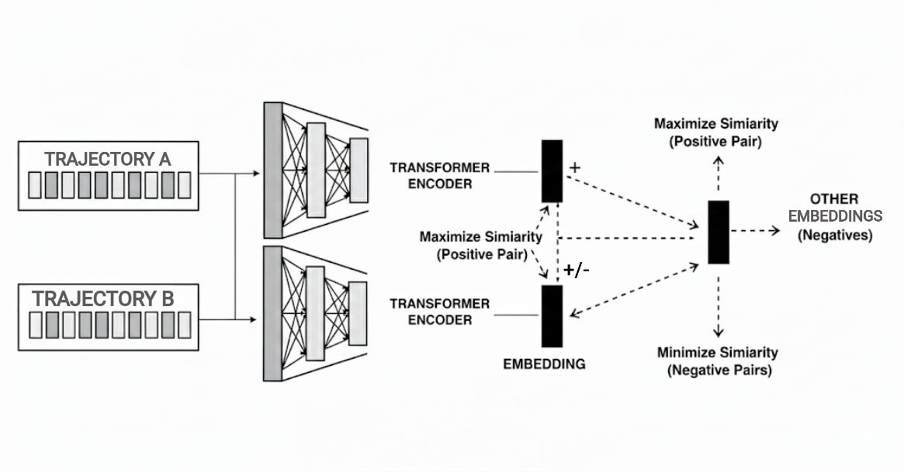
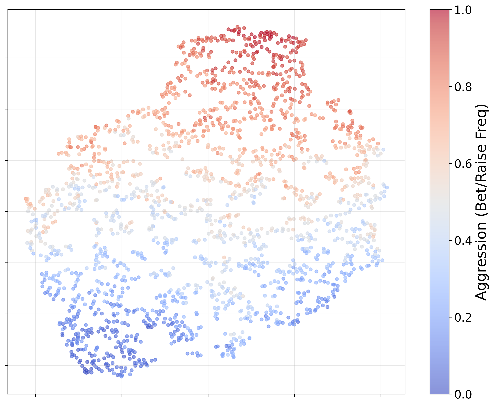
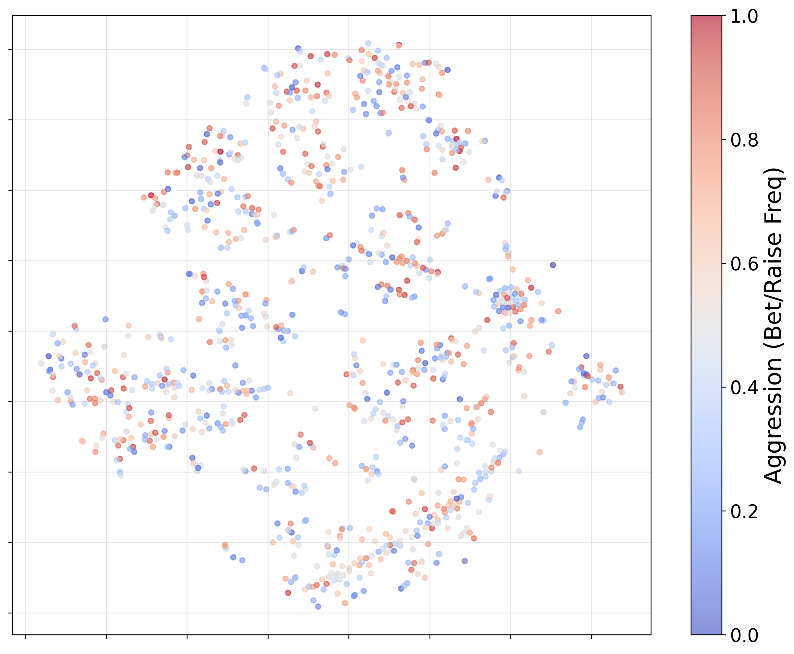

# Towards Learning Representations of Policies in Two-Player Zero-Sum Imperfect-Information Games

[](https://arxiv.org/abs/2607.01498)
[](https://sites.google.com/view/nextgame-icml26/)
[](LICENSE)
[](#setup)

Kevin Wang\*, Kevin Yang\*, Arjun Prakash, and Amy Greenwald (Brown University)

**[ICML 2026 NeXT-Game Workshop](https://sites.google.com/view/nextgame-icml26/)** — Spotlight / Oral presentation.

[`arXiv:2607.01498`](https://arxiv.org/abs/2607.01498) · [`paper/main.pdf`](paper/main.pdf)

## TL;DR

We study self-supervised learning of **policy representations** — embeddings that capture *how an agent plays* — in two-player zero-sum imperfect-information games (Kuhn and Leduc Poker, with larger games in the appendix). To our knowledge this is among the first systematic comparisons of SSL techniques for policy representations in this domain, and it makes three kinds of contributions:

1. **Ways to build datasets of policies.** Useful representations need diverse policy populations to learn from. We contribute methods to generate them — a diversity-promoting random initialization, PSRO, and NeuPL — and show the default PyTorch initialization produces populations that are far *less* behaviorally diverse.
2. **Ways to encode policies.** We compare encoders that read policy *weights* directly (identity, weight autoencoder), encode a policy's *outputs* over information states (functional autoencoder), condition on a population (NeuPL), or embed *behavioral trajectories* (a contrastive Transformer, plus the Grover hybrid baseline).
3. **Downstream tasks to evaluate them.** A suite of probes (payoff prediction, exploitability, best-response, agent identification, retrieval, …) run on *frozen* embeddings with a linear head.

**What we find.** The trivial encoders — identity and weight reconstruction — never beat a naive mean-prediction baseline. The two more interesting approaches do: **NeuPL** embeddings improve over baseline on payoff, exploitability, and best-response tasks, and a **contrastive trajectory encoder** learns compact 128-dim behavioral representations that transfer. The trajectory encoder and the Grover baseline show **complementary strengths** — Grover's hybrid objective helps payoff prediction, while our contrastive encoder is far stronger at *identifying which agent* generated a trajectory.

<p align="center">
  
</p>

## Key results

**Agent identification (Task E).** Classify which of 500 held-out agents produced a trajectory (5 train / 5 test trajectories per agent; random baseline 0.2%). The contrastive trajectory encoder is substantially more discriminative than the Grover hybrid baseline.

| Encoder | Classifier | Kuhn top-1 (%) | Leduc top-1 (%) |
|:---|:---|---:|---:|
| **Trajectory (contrastive)** | Linear | **47.9 ± 0.6** | **57.8 ± 0.9** |
| **Trajectory (contrastive)** | k-NN | **39.9 ± 1.3** | **45.3 ± 1.8** |
| Grover (hybrid) | Linear | 25.7 ± 0.5 | 38.9 ± 0.7 |
| Grover (hybrid) | k-NN | 24.8 ± 0.1 | 34.0 ± 2.0 |

**Payoff prediction (Task A).** On Kuhn Poker a lossless 24-dim tabular representation is hard to beat and all methods are comparable (~71–72%). As games grow, the tabular vector balloons (2808-dim in Leduc) and the learned 128-dim encoders overtake it: on Leduc Task A, learned encoders reach 27.8–32.3% improvement over baseline vs. 22.0% for tabular. Grover's hybrid generative-discriminative objective gives it a consistent edge here — the mirror image of the identification result.

The two behavioral encoders are thus **complementary**: contrastive learning wins at *who the opponent is*, the hybrid objective wins at *how the opponent affects payoffs*.

Embeddings capture behaviorally meaningful structure without style supervision — in Kuhn Poker, policies cluster by aggression (bet/raise frequency) under the trajectory encoder:

<p align="center">
  
  
</p>

## Policy datasets

Representation quality depends on the diversity of the policy population. This repo builds populations three ways:

| Method | Description | Entry point |
|:---|:---|:---|
| Diverse random init | Orthogonal init (scale 2.2) with randomized final-layer biases — more behaviorally diverse than PyTorch defaults | `policy_repr/datasets/generate_agents.py`, `policy_repr.utils.make_diverse_random_kuhn_poker_layer_init` |
| PSRO | Policy-Space Response Oracles populations | `policy_repr/datasets/psro.py`, `configs/psro_*.yaml` |
| NeuPL | Neural Population Learning conditional-policy embeddings | `configs/neupl.yaml` |

## Encoders compared

| Encoder | Input modality | Objective | File |
|:---|:---|:---|:---|
| **Trajectory (contrastive)** | Behavioral *(state, action, reward)* trajectories | Contrastive | `policy_repr/encoders/trajectory.py` |
| Grover (hybrid) | Behavioral trajectories | Imitation + triplet identification | `policy_repr/encoders/grover.py`, `policy_repr/encoders/train_grover.py` |
| Functional autoencoder | Policy outputs over sampled information states | Reconstruction | `policy_repr/encoders/functional_autoencoder.py` |
| Weight autoencoder | Raw policy-network weights | Reconstruction | `policy_repr/encoders/weight_autoencoder.py` |
| Identity (baseline) | Raw policy-network weights | — | passthrough |
| NeuPL | Population-conditioned policy embedding | — | `configs/neupl.yaml` |

## Downstream tasks

Each frozen encoder is probed with a linear head; the baseline predictor is the training-set mean.

| Task | What it tests | Entry point |
|:---|:---|:---|
| **A** — Fixed-opponent payoff | Predict an agent's expected payoff vs. a fixed opponent | `policy_repr.downstream.heads.PayoffPredictor` (`policy_repr.downstream.main.test_downstream_task_a`) |
| **B** — Pairwise payoff | Predict the payoff of an agent-vs-agent matchup | `policy_repr.downstream.main.test_downstream_task_b` |
| **C** — Exploitability | Embed a P1 policy, predict P2's best-response payoff | `policy_repr.downstream.heads.StatePayoffPredictor` (`policy_repr.downstream.main.test_downstream_task_c`) |
| **D** — Best-response | Train a zero-shot PPO best-responder against embeddings | `policy_repr/eval/with_payoffs.py` |
| **E** — Agent identification | Classify which held-out policy produced a trajectory (Grover et al., 2018) | `policy_repr/downstream/agent_identification.py` |
| **App** — Opponent adaptation | Select a counter-strategy against a novel opponent from a payoff-labeled library | `policy_repr/eval/opponent_adaptation.py` |

## Repository map

| Path | Contents |
|:---|:---|
| `paper/` | LaTeX source and compiled `main.pdf` for the workshop paper |
| `src/policy_repr/` | The installable Python package (all core modules) |
| `policy_repr/downstream/main.py` | Runs the downstream-task suite (Tasks A/B/C) across encoders and games |
| `policy_repr/encoders/trajectory.py` | Contrastive trajectory Transformer encoder (our main model) |
| `policy_repr/encoders/functional_autoencoder.py`, `.../weight_autoencoder.py` | Functional and weight-space autoencoder baselines |
| `policy_repr/encoders/grover.py`, `.../train_grover.py` | Grover hybrid baseline and its training script |
| `policy_repr/downstream/heads.py` | `PayoffPredictor` / `StatePayoffPredictor` downstream heads |
| `policy_repr/downstream/agent_identification.py` | Task E: agent-identification probe |
| `policy_repr/eval/` | Opponent-adaptation and embedding-based payoff evaluations |
| `policy_repr/datasets/` | Policy-dataset generation (random / PSRO / NeuPL) and payoff precomputation |
| `policy_repr/viz/` | t-SNE embedding and downstream-result visualizations |
| `tests/test_*.py` | Per-encoder unit / smoke tests |
| `experiments/` | Exploratory scripts (encoder comparison, Grover VAE variant) |
| `configs/` | PSRO / NeuPL experiment configs |
| `figures/` | Figures used in this README (from the paper) |
| `checkpoints/`, `results/` | Trained encoders and aggregated result tables (generated; not distributed) |

## Reproducing the comparison

All commands are run from the repo root (after `pip install -e .`), which is also
where the `configs/`, `checkpoints/`, `results/`, and `logs/` directories live.

```bash
# 1. Generate a diverse agent pool for a game
python -m policy_repr.datasets.generate_agents --game kuhn_poker --num-agents 500 --seed 42

# 2. Train the Grover hybrid baseline
python -m policy_repr.encoders.train_grover --game kuhn_poker --num-agents 500 --epochs 200 --seed 42

# 3. Run the downstream-task suite (payoff prediction) across encoders
python -m policy_repr.downstream.main

# 4. Agent-identification probe (Task E)
python -m policy_repr.downstream.agent_identification --game kuhn_poker --seed 42

# 5. Opponent-adaptation application (consumes artifacts produced by the steps above)
python -m policy_repr.eval.opponent_adaptation \
    --game "liars_dice(numdice=1,dice_sides=4)" \
    --encoder trajectory \
    --checkpoint <trajectory-encoder checkpoint> \
    --agent-pool <agent pool> \
    --payoffs <precomputed payoff matrix> \
    --seed 42
```

Trained encoder checkpoints, agent pools, and payoff matrices are **not distributed** with this repository — they are generated by the pipeline above (`policy_repr.datasets.generate_agents`, `policy_repr.encoders.train_grover` / the encoder trainers, `policy_repr.datasets.precompute_payoffs`). Games are loaded through OpenSpiel by short name — e.g. `kuhn_poker`, `leduc_poker`, `liars_dice(numdice=1,dice_sides=4)`.

## Setup

The project builds on [OpenSpiel](https://github.com/google-deepmind/open_spiel) and the `iig_rl_benchmark` PPO implementation.

```bash
python3.10 -m venv .venv
source .venv/bin/activate
pip install torch numpy scikit-learn tqdm open_spiel
# plus iig_rl_benchmark (PPO agents) — see its repository for install instructions

pip install -e .                                  # install the policy_repr package (src layout)
python -m pytest tests/test_trajectory_encoder.py -q   # smoke test
```

## Acknowledgments

Thanks to Randall Balestriero for inspiring this work and for helpful discussions. This material is based upon work supported by the National Science Foundation CISE Graduate Fellowships under Grant No. 2313998. The agent-identification task and the hybrid baseline follow **Grover et al. (2018)**, *Learning Policy Representations in Multiagent Systems*; games and PPO agents build on [OpenSpiel](https://github.com/google-deepmind/open_spiel).

## Citation

```bibtex
@inproceedings{wang2026policyrepresentations,
  title={Towards Learning Representations of Policies in Two-Player Zero-Sum Imperfect-Information Games},
  author={Wang, Kevin and Yang, Kevin and Prakash, Arjun and Greenwald, Amy},
  booktitle={ICML 2026 NeXT-Game Workshop},
  year={2026}
}

@inproceedings{grover2018learning,
  title={Learning Policy Representations in Multiagent Systems},
  author={Grover, Aditya and Al-Shedivat, Maruan and Gupta, Jayesh K. and Burda, Yuri and Edwards, Harrison},
  booktitle={International Conference on Machine Learning (ICML)},
  year={2018}
}
```
